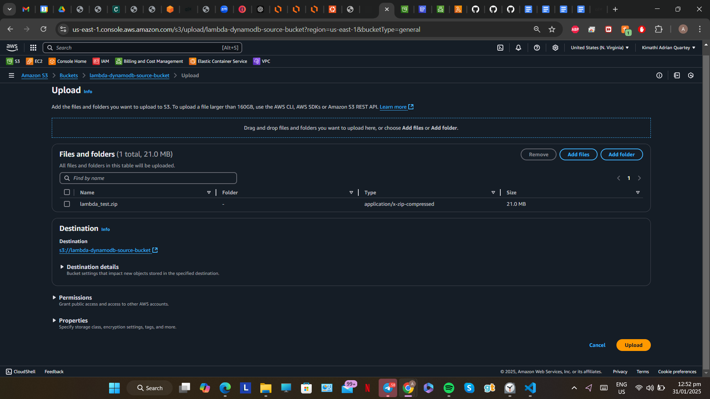

# **Serverless Media ETL Pipeline with Lambda and DynamoDB**

**Project Introduction**   
In this serverless project, I’ll be creating a lambda function that will perform an extract, load and transform(ETL) batch job on zip files uploaded to a source bucket. The resulting outputs which are media files and noSQL items will be uploaded to a destination s3 bucket and DynamoDB table respectively. This project serves as the back end of a larger project I'll be completing. The project is meant to demonstrate: my skill set using the AWS sdk for Node JS, my ability to use lambda, S3 and DynamoDB and my understanding of IAM roles.

**Project Diagram**  
  
The diagram above displays two S3 buckets to be created in the us-east-1 region; a source bucket and destination bucket. A lambda function will be created to perform the ETL batch job. The trigger for the function invocation is “all create object events” that occur in the source bucket, this means that when a new object with the suffix: ”.zip” is uploaded to the source bucket, the function is triggered. The lambda execution role created will be given additional permissions to read from the source bucket, write to the destination bucket and full access to the DynamoDB table. The function will create new items in the DynamoDB based on a JS file in the zip file and it will upload media content to the destination bucket from directories in the zip file. We can use the cloudwatch logs to track the workflow of the function code to diagnose any errors.

**What is Lambda?**  
Lambda is an AWS compute service that allows you to run code in a number of runtime environments without provisioning servers. It is event driven; it executes code based on triggers from native AWS services and other select third party sources. You only define the memory and storage capacity needed by your code during its execution time(max of 15 minutes). Processing power is scaled and handled automatically based on your code.

**What is DynamoDb?**  
DynamoDB is a fully managed NoSQL database service native to AWS. It has very high availability, scalability and offers very low latency. Since it is fully managed, there is no need to provision servers to run the database.

**Services Used**

- Lambda  
- S3  
- DynamoDB  
- IAM  
- CloudWatch

**The Project**  
The code I wrote for the lambda function, the source zip file and  the lambda layer dependencies will be provided in this repository. I'll first be explaining the files and directories used.

- `s3-dynamodb.mjs` is the function code written in nodejs  
- The `Poster_Images` directory contains the movies’ images files to be uploaded to the destination bucket.  
- The `Movie_Videos` directory contains the actual video files for the movies. These files will also be eventually uploaded to the destination bucket by the lambda function.  
- If this scenario is a bit hard to follow, imagine the structure of Amazon Prime Video or Netflix; there exists multiple movie tiles to select from. The poster image for these movie tiles will exist in the `Poster_Images` folder. When you tap or click a tile, it sends you to another page where you can either start playing the movie or to watch the trailer first. These video files for the movies are stored in `Movies_Videos`.  
- `test.js` is a javascript file that contains an array of items to be uploaded to the DynamoDB table. Each item is represented as an object as I found this more convenient than using a json file.

  

- Inside `Poster_Images`

  

- Inside `Movie_Videos`. I'm not actually using 2 hour movie video files. Just a short stock video that I've renamed for each of the movies.

  

- The contents of `test.js`. In the AWS sdk for node js, the items to be uploaded to DynamoDB are written as objects. This is why I've written test.js is as a javascript file and not a JSON file, as parsing json code to javascript would have left both the key and value in quotation marks: `{“Name”: “Avengers Infinity War”}`. The DynamoDB client expects an item in the format: `{Name: “Avengers Infinity War”}`

  

- Since we are importing some modules in our function code, we need to create a lambda layer.

  
- To download the standard node js modules, run: `npm init -y` to initialize the directory as a node project.

  

- To install the AWS sdk and jszip dependencies to the node modules, run: `npm install aws-sdk jszip`. vm is already standard in th nodejs modules so no need to install it. Looking at the left column, aws-sdk and jszip have been added.

    
  

- To properly structure the dependencies for the lambda layer, we need to bundle the modules as well as `package.json` and `package-lock` in a folder called nodejs and then compress it to a zip file.

      

- Now we need to bundle the `test.js` file, which contains the array of movie items, with the `Movie_Videos` and `Poster_Images` folders to a compressed zip file. This lambda_test zip file is what will be uploaded to the source bucket. 

  

In this next section, I'll be explaining how the function code works.

- The dependencies for: aws-sdk, jszip and vm are imported. Jszip is used to unzip the lambda_test file that will be received in the source bucket. The vm (Virtual Machine) module in Node.js is used to run JavaScript code within a separate, sandboxed execution context. This will be used later on to get the contents of the `test.js` file after unzipping lambda_test.  
- The `const dynamodb = new AWS.DynamoDB.DocumentClient()` line initializes a DynamoDB Document Client, which is used to interact with AWS DynamoDB for reading and writing human-readable JSON objects in DynamoDB.  
- The `const s3 = new AWS.S3` line creates an s3 client instance, this enables the Lambda function code to perform operations like uploading, downloading, deleting, and listing objects in S3.

  

- The `const getLatestPartitionKey` function is used to get the latest partitionkey value from the DynamoDB table. This function will be called later on in the code.

  

- When a new zip file is detected in the source bucket it is downloaded and saved to `const zipFile`.  
- The JSZip module is called and used to unzip zipFile.  
- Images found in the zip file are saved to the images variable and the videos found are saved to the videos variable.

  

- In this nested for loop, the images and videos from the zip file are uploaded to the specific folder(in the destination bucket) whose folder name matches the file name of the images and videos.  
- The s3 URIs for the uploaded images and videos are added to the matching item and uploaded to the DynamoDB table upon every iteration through the array of items in the `test.js` file.

  

Now let's head into the AWS console:

- The source and destination s3 buckets.  
- The lambda_test zip file will be uploaded to `lambda-dynamodb-source-bucket` and the resulting media files will be uploaded to directories created by the function in `lambda-dynamodb-destination-bucket`. 

  

- Creating the DynamoDB table.  
- The table is empty currently but should be populated once the lambda function is invoked.

  

- Creating the lambda layer to be used by the lambda function.

    
  

- Creating the lambda function

  

- After creating the lambda function, we need to add the trigger for the function invocation.  
- The code will be triggered when any file with the suffix .zip is uploaded to `lambda-dynamodb-destination-bucket`.

  

- In the basic settings for the function, we need to edit the memory and timeout capacities as this ETL workflow requires more than 3 seconds of runtime.  
- The role also needs to be edited to allow read actions in the source bucket and write actions in the destination bucket.

  

- The role currently has only one policy attached which contains permissions to read and write to cloudwatch. I'll be creating two inline policies to attach to the role.

  

- The first is a policy to perform `GetObject` actions in the source bucket.

  

- The second is a policy to perform `PutObject` actions in the destination bucket.

  

- Lastly, I'll be attaching an AWS owned DynamoDB full access policy to the role.This is definitely not advised in a production/live environment. You should write a restricted policy to allow the actions required for specified tables.

  

- There are now four policies in total attached to the role

  

- Pasting the code to the function. The code can also be uploaded as a zip file.  
- After the code is pasted you can deploy it.

  

- Uploading the lambda_test zip file to the source bucket.

  

- Once the zip file is uploaded to the bucket, we can check the cloudwatch log group created by the function to examine the progress of the ETL workflow. You can also view the metrics in the monitor tab of the lambda function but it takes about two minutes to update.  
- From the logs, the code took 9 seconds to run and used 219 MB of memory. The items from the `test.js` file are also displayed.

    
  

- Checking out the destination bucket, we can observe that various folders have been created matching the file names of the media files.  
- Observe the file structure of the `Avengers_Infinity_War` directory.

    
  

- The same file structure is seen in `The_Amazing_Spider-Man_2` directory.

  

- Viewing one of the image files in the `Poster_Images` directory for `The_Amazing_Spider-Man_2`.  
- The same s3 URI should be stored in the DynamoDB table in the matching item.

  

- Checking out the video files in the `Movie_Videos` directory. The stock video can be seen and played.

  

- When we view the DynamoDB table, it should be populated with the items from the `test.js` file along with the S3 URIs of the matching images and video files. Each item should also have a matching partition key value in ascending order from the value the partition key function returned.

  

- The Image_url and Video_url keys are stored as lists. Since they can contain multiple values.

   
  

- This brings us to the end of the demonstration for this project.

Challenges encountered and lessons learned.

1. During the project, I didn't know that lambda no longer had the module for the AWS sdk pre-installed. So I had to add the module to the lambda layer.  
2. I didn't know that even after you deleted a trigger, the event notification remained with that bucket.  
3. I originally had the timeout for my function set to the default 3 seconds and upon investigating the cloudwatch logs, i discovered the request kept timing out. After setting the timeout to 40 seconds, the function ran without any problems.  
4. In a live environment scenario, it would be safe to create an IAM role with s3 access to the source bucket. This role would only be given to employees who are permitted to upload the zip files to the source bucket.  
5. Another role could be created for employees who are authorized to access the DynamoDB table to view or edit items.  
6. It would also be more secure to create a custom policy for the lambda function role to access the “Movies” DynamoDb table, instead of using the DynamoDB full access policy.  
7. Using this project in a live environment, since the maximum ephemeral storage size for a lambda function invocation is 10GB, the maximum size for each zip file being uploaded to the source bucket should be considered.

Future plans  
As I stated earlier in this write-up, this project is part of the backend of a larger project I'm working on. I'll be building a netflix-like front end interface that would display each movie tile by iterating through the items in the DynamoDB table and the destination bucket. The site would be hosted on either Amplify, Elastic beanstalk or an ec2 instance directly.
